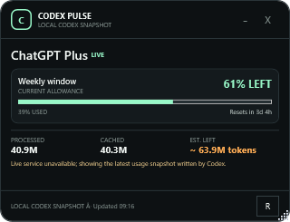

# Codex Pulse



Codex Pulse is a compact cross-platform widget for ChatGPT/Codex subscription usage. It supports Windows, macOS, and Ubuntu/Linux through Electron.

- Reuses `%USERPROFILE%\.codex\auth.json`; no second login or API key.
- Detects Plus, Pro 5×, Pro 20×, Business, Enterprise, and Free where exposed.
- Displays every quota window returned by Codex, with remaining percentage and reset countdown.
- Refreshes usage automatically every minute.
- Drag it from any non-button area of the widget.
- Shows local token telemetry and a clearly-labelled rough token-equivalent remainder.
- Uses the live usage service with an automatic fallback to Codex's latest local rate-limit snapshot.
- Keeps the access token local and sends it only to `chatgpt.com`.

## Run from source

Install [Node.js](https://nodejs.org/) 20 or newer, then run:

```sh
npm install
npm start
```

## Build installers

Run `npm run dist` on the target operating system. The packaged files are written to `dist/`:

- Windows: NSIS installer and portable executable
- macOS: DMG and ZIP
- Linux: AppImage and Debian package

The original PowerShell/WPF edition remains in the repository for Windows users who prefer a dependency-free script. Double-click `Start Codex Pulse.vbs` to run it.

OpenAI does not define subscription allowance as a single fixed token bucket. Usage percentages and reset timestamps are authoritative; the remaining-token figure is an estimate.
